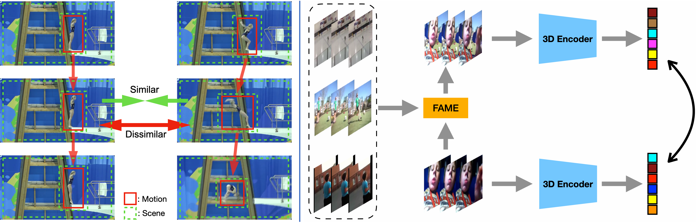

# Motion-aware Contrastive Video Representation Learning via Foreground-background Merging
Official pytorch implementation of our CVPR 2022 paper [Motion-aware Contrastive Video Representation Learning via Foreground-background Merging.](https://arxiv.org/abs/2109.15130)

## Overview
Contrastive learning in the video domain exists severe background bias. When naively pulling two augmented views of a video closer, the model however tends to learn the common static background as a shortcut but fails to capture the motion information, a phenomenon dubbed as background bias. We introduce Foreground-background Merging (FAME), a novel augmentation technique to deliberately compose the moving foreground region of the selected video onto the static background of others. Specifically, without any off-the-shelf detector, we extract the moving foreground out of background regions via the frame difference and color statistics, and shuffle the background regions among the videos. By leveraging the semantic consistency between the original clips and the fused ones, the model focuses more on the motion patterns and is debiased from the background shortcut. 



[[Project Page]](https://mark12ding.github.io/project/CVPR22_FAME/) [[arXiv]](https://arxiv.org/abs/2109.15130) [[PDF]](https://mark12ding.github.io/project/CVPR22_FAME/asset/CVPR22_FAME.pdf)

## Usage

### Requirements
- pytroch >= 1.8.1
- tensorboard
- cv2
- kornia

### Data preparation
- Download the Kinetics400 dataset from the [official website](https://deepmind.com/research/open-source/kinetics).
- Download the UCF101 dataset from the [official website](https://www.crcv.ucf.edu/data/UCF101.php).


### Pretrain
In default, we train backbone I3D on K400 on a single node with 8 NVIDIA V100 gpus for 200 epochs. 
```python
python3 train.py \
  --log_dir $your/log/path \
  --ckp_dir $your/checkpoint/path \
  -a I3D \
  --dataset k400 \
  --lr 0.01  \
  -fpc 16 \
  -cs 224 \
  -b 64 \
  -j 128 \
  --cos \
  --epochs 200 \
  --dist-url 'tcp://localhost:10001' --multiprocessing-distributed --world-size 1 --rank 0 \
  $kinetics400/dataset/path
```

### Pretrained Model
I3D after pretrain on K400 [[google drive]](https://drive.google.com/file/d/1hPcV9gywiNVX0URVWWQprZvhzbRq_bov/view?usp=sharing)

I3D after finetune on UCF101 (Acc@1 88.9) [[google drive]](https://drive.google.com/file/d/1kAxcnDw4VEy1QHRDoNXO9RjWHq1AuWse/view?usp=sharing)

### Action Recognition Downstream Evaluation
In default, we finetune backbone I3D on UCF101 on a single node with 4 NVIDIA V100 gpus for 150 epochs.
```python
python3 eval.py \
  --log_dir $your/log/path \
  --pretrained $your/checkpoint/path \
  -a I3D \
  --seed 42 \
  --num_class 101 \
  --wd 1e-4 \
  --lr 0.025 \
  --weight_decay 0.0001 \
  --lr_decay 0.1 \
  -fpc 16 \
  -b 128 \
  -j 64 \
  -cs 224 \
  --finetune \
  --epochs 150 \
  --schedule 60 120 \
  --dist-url 'tcp://localhost:10001' --multiprocessing-distributed --world-size 1 --rank 0 \
  $ucf101/dataset/path
```
## Visualization
We visualize class-agnostic activation maps. FAME can well caputre the foreground motion while the baseline method fails.


## Acknowledgement
Our code is based on the implementation of [VideoMoCo](https://github.com/tinapan-pt/VideoMoCo) and [MoCo](https://github.com/facebookresearch/moco). We sincerely thanks those authors for their great works.


## Citation
If our code is helpful to your work, please consider citing:
```
@inproceedings{ding2022motion,
  title={Motion-Aware Contrastive Video Representation Learning via Foreground-Background Merging},
  author={Ding, Shuangrui and Li, Maomao and Yang, Tianyu and Qian, Rui and Xu, Haohang and Chen, Qingyi and Wang, Jue and Xiong, Hongkai},
  booktitle={Proceedings of the IEEE/CVF Conference on Computer Vision and Pattern Recognition},
  pages={9716--9726},
  year={2022}
}
```


